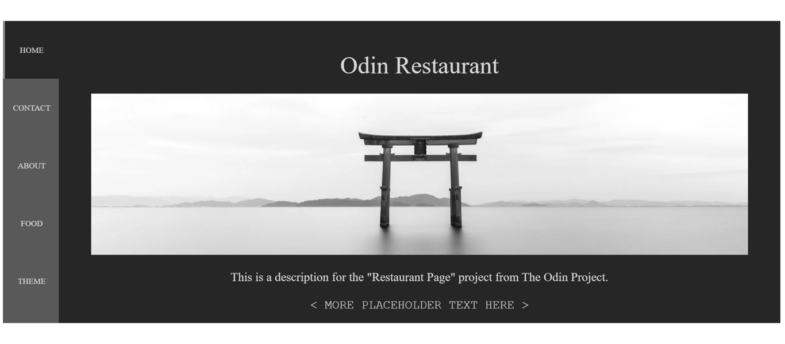

# Odin Restaurant Page

> A simple, dynamically rendered JavaScript App.

[//]: # (Screenshot, Application concept art etc)


[//]: # (Live Demo link)
<p align="center">
  <a href="https://juzqrios.github.io/odin-restaurant-page">Live Demo</a>
</p>

## Built With

* HTML
* CSS
* JavaScript

## Get Started

### Setup

1. Clone this repository.

```bash
git clone git@github.com:juzQrios/odin-restaurant-page.git
```

2. Install dependencies.

```bash
npm install
```

3. Start Webpack dev server.

```bash
npm run start
```

4. Open `./dist/index.html` in a browser.

### Tests

While it is a good practice to test code, this project doesn't have any tests right now but I might add them in future.

### Deployment

Deploy `./dist` folder.

## Contributing

Contributions, issues and feature requests are welcome!

Feel free to checkout this project's [Kanban board](https://github.com/juzQrios/odin-restaurant-page/projects/1) or [issues page](https://github.com/juzQrios/odin-restaurant-page/issues).

## Acknowledgments

* [Webpack](https://webpack.js.org/)

## License

This project is [MIT](./LICENSE) licensed.

## Authors

#### Darshan

* GitHub: [@juzQrios](https://github.com/juzQrios)
* Linkedin: [Darshan J](https://www.linkedin.com/in/jayadevdarshan/)
* Email: <dj30c.1@gmail.com>
